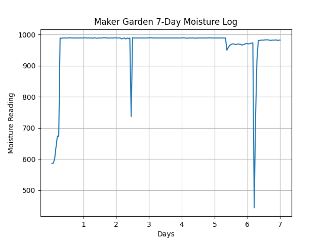
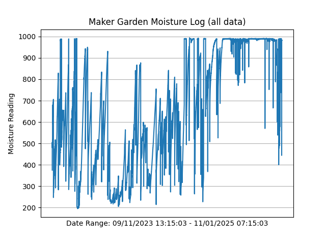

# MakerGarden

<h2>By: Matthew I. Swindall</h2>
 

 

The Maker Garden is a project for the MTSU Makerspace. The garden monitors soil moisture and automates watering of the plants contained in the garden. In it's current iteration, Maker Garden utilizes a separate grow lamp to ensure plants receive enough light, but additional red and blue light are provided by an LED matrix to encourage plants to grow and bloom. The project utilizes code written in Python and C++ (utilizing Arduino libraries). Soil moisture sensing is performed by an arduino controlled moisture sensor, which transmit the data to a Raspberry Pi3. When the moisture reading is too low (determined by the Pi) a 12V water pump is turned on via 12V relay. LED lighting is also controlled via the Raspbery Pi. Physical components include:
<ul>
  <li>Raspberry Pi 3 Model B V1.2
  <li>Arduino Nano
  <li>Flexible 8x32 Neopixel RGB LED Matrix
  <li>Soil Moisture Sensor Module
  <li>Soil Moisture Sensor
  <li>12 Volt Relay Module
  <li>12 Volt DC Water Pump
  <li>Wooden Planter Box
  <li>plastic Bins and Lining
  <li>Silicone air tube
  <li>Watering Irrigation Kit
</ul>

  <h1>Moisture Log Plots</h1>
    
  
    
  

